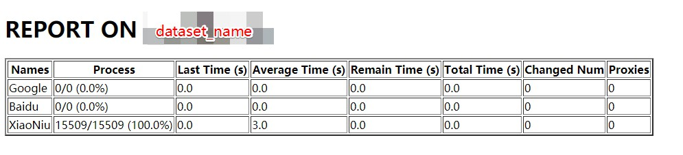

# TransAPI
A non-stop trans API toolkit with proxy pools.

## Requirement

- Python 3.5.2 or later
  - requests>=2.22.0
  - flask>=1.1.1
  - googletrans>=2.4.0
  - nltk>=3.4.4

## Installation

```bash
$ pip install requests flask googletrans nltk
$ python
>>> import nltk
>>> nltk.download('punkt')
```

## Quick Start

- First, you should make sure your data has been converted to a standard format. You can modify `transkit/utils` to create your data utilities, especially to overload `load_data`.

- Second, you should fill in your *Baidu* API key and *Xiaoniu* API key if you'd like to use these translators.

- Then, change the `main.py` file to meet your own needs. Here, I provide a demo on back-translation.
- For this demo, you can open your browser and go to `http://<your server ip>:5000` to see your working process, like this



## LICENSE

MIT LICENSE